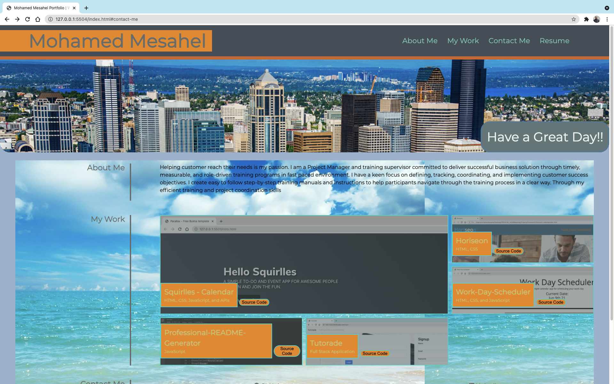

# About-me
My first start up Portfolio using html and css only for design and styling.

## Motivation for this Porject
I wanted to start working on my portfolio and use my recent skills with HTML and CSS

### Screen Shots


## User Story

```
AS AN employer
I WANT to view a potential employee's deployed portfolio of work samples
SO THAT I can review samples of their work and assess whether they're a good candidate for an open position
```

## Reasons for this Project
To provide a start up interactive portfolio page with some ifno regarding the developer
### Link to Live Demo

[Mohamed-Mesahel](https://mohamedmesahel.github.io/My-Portfolio/)

**Coded with:**
   *HTML
   *CSS
